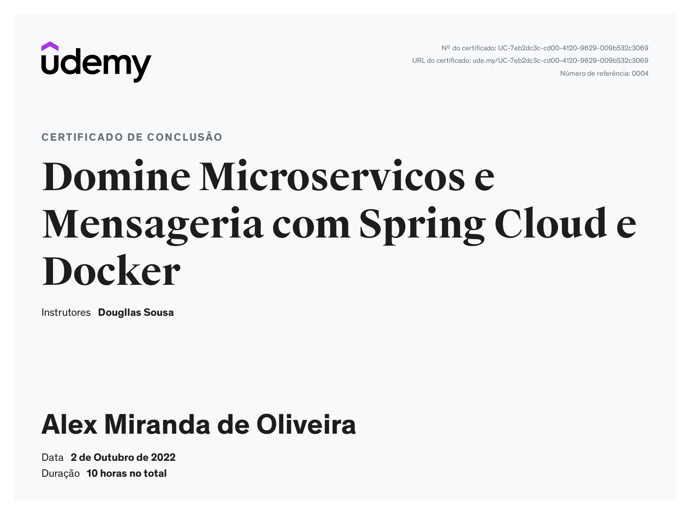
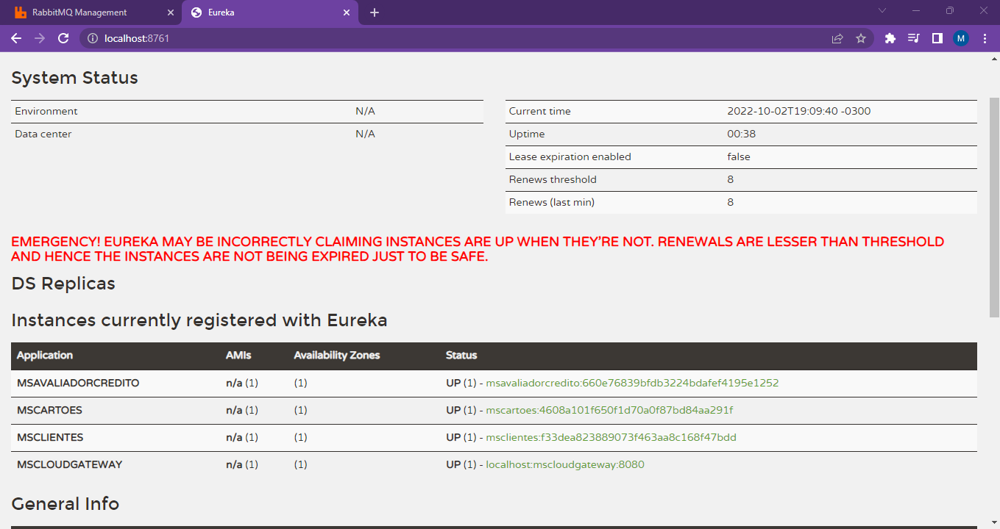
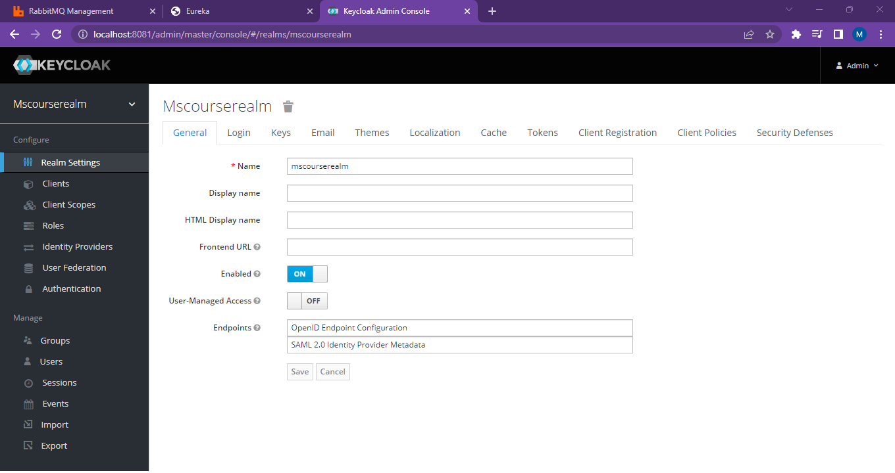
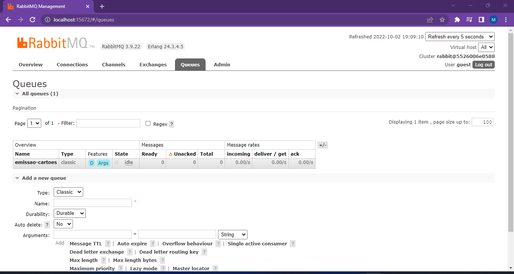
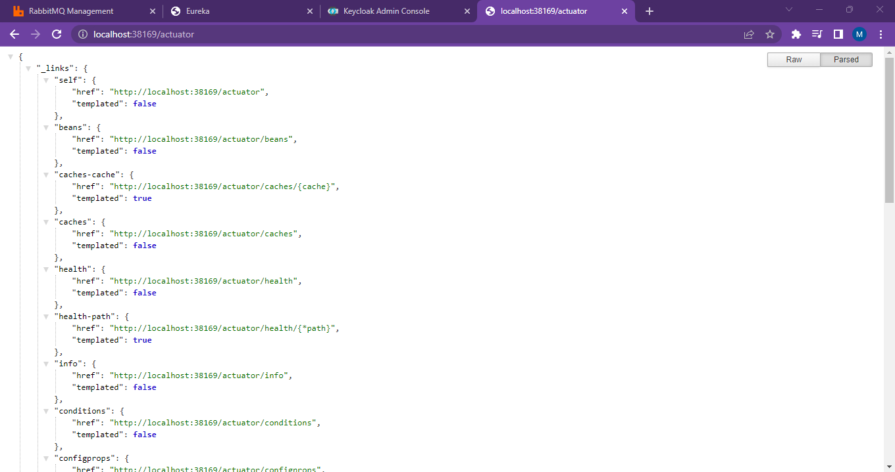
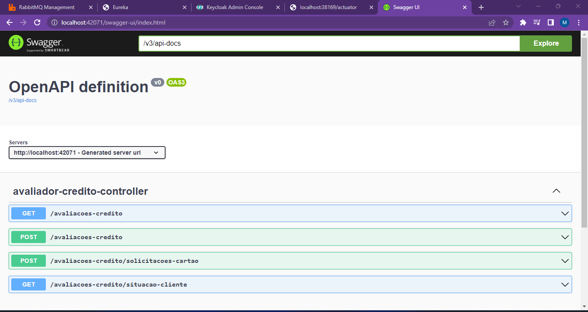
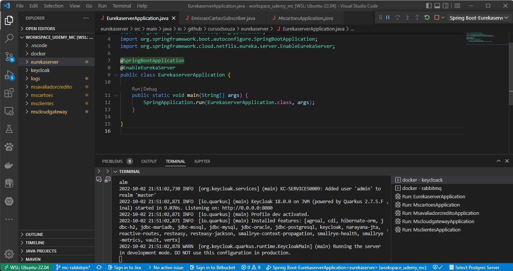
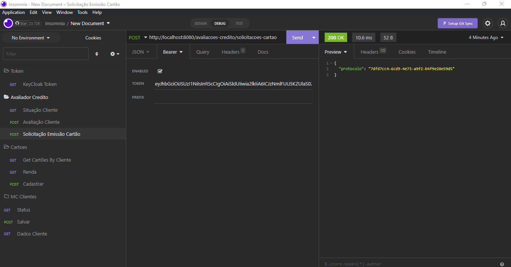

Curso Spring Cloud Microserviços 
- Tecnologias
   - Java 17
   - Spring Cloud
   - Spring Cloud Eureka Server
   - Spring Data JPA
   - Banco de dados H2
   - Spring MVC RestController
   - Spring Cloud Gateway
   - Keycloak (Autenticação e Autorização)
   - RabbitMQ (Messageria)
   - Docker

# Certificado de Curso Spring Cloud Microserviços

# Eureka Server

# Keycloak usando para autenticação e autorização

# RabbitMQ Usado para messageria

# Spring boot Actuator

# Swagger - OPEN API

# Projeto Microservicos  VSCode

# Projeto Microservicos testes com Insomnia

